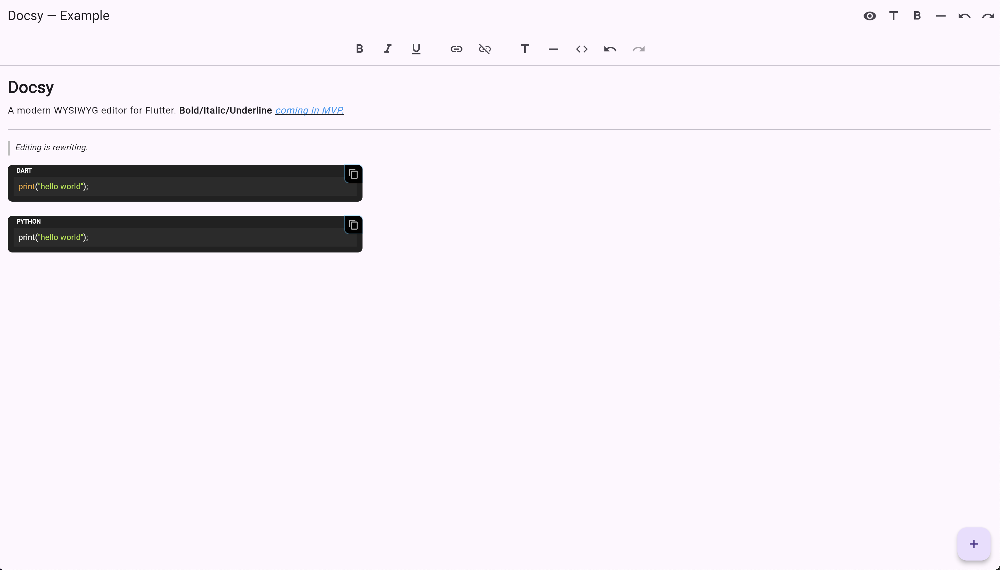
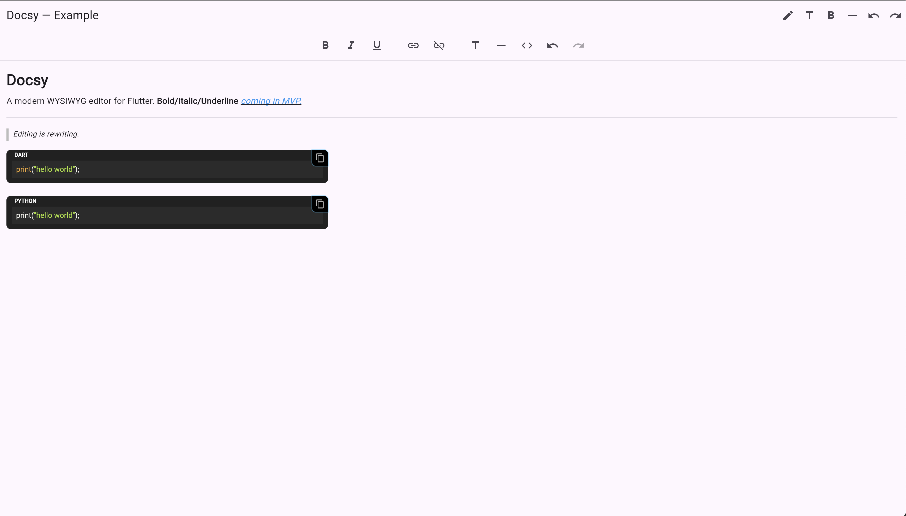

# Docsy Example

This package provides an example Flutter application showcasing the usage of the **Docsy** rich text editor and its related packages.

## 🚀 Features

- Demonstrates integration of **docsy** editor.
- Shows how to use **docsy_toolbar** for formatting actions.
- Example document included for quick start (`assets/example_document.json`).
- Works across mobile, web, and desktop.

## 📸 Screenshots

### Editor Mode


### Readonly Mode


## 📦 Getting Started

1. Navigate to this directory:
   ```bash
   cd docsy_example
   ```

2. Get the dependencies:
   ```bash
   flutter pub get
   ```

3. Run the example app:
   ```bash
   flutter run
   ```

## 📂 Project Structure

- `lib/main.dart`: Entry point of the example app.
- `assets/example_document.json`: Example document to load in the editor.
- `web/`: Web runner files for Flutter web.

## 🤝 Contributing

Contributions are welcome! If you want to improve the editor or its ecosystem, feel free to open PRs or issues in the main repository.

## 📜 License

This project is licensed under the MIT License. See the LICENSE file for details.
