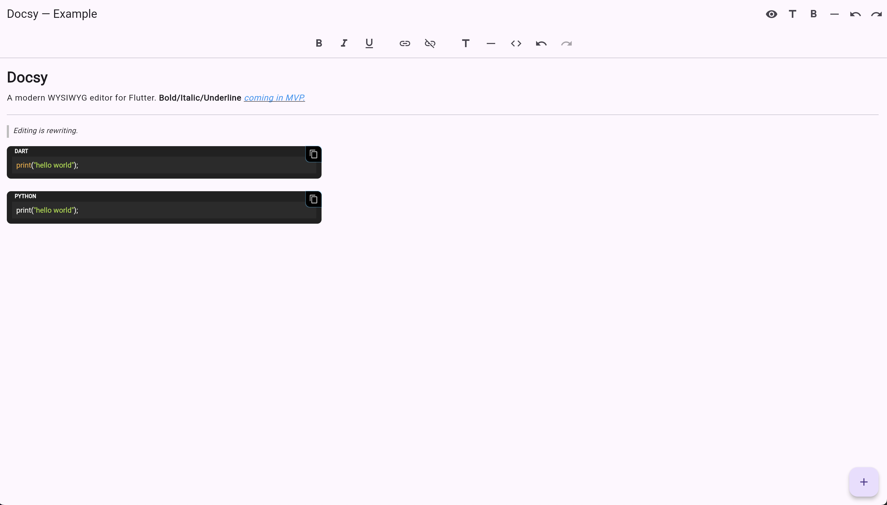
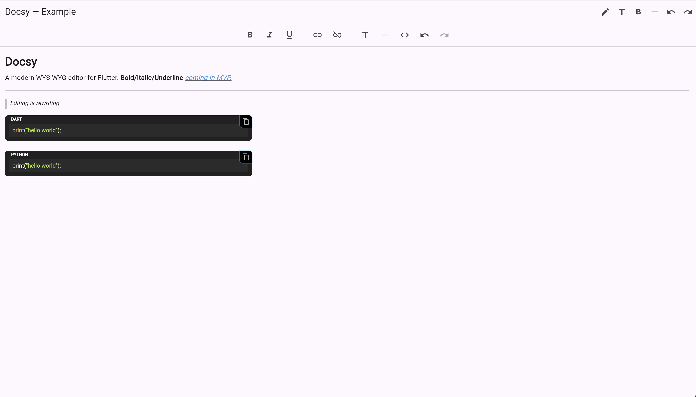

# Docsy Toolbar

A simple, customizable toolbar for the
[Docsy](https://pub.dev/packages/docsy) WYSIWYG editor.\
It provides buttons for common text formatting actions (bold, italic,
underline, links, headings, dividers, undo/redo, and more).

[](https://astrodevs-team.github.io/Docsy/)

------------------------------------------------------------------------

## ✨ Features

-   Bold / Italic / Underline toggles
-   Insert & remove links
-   Insert headings and dividers
-   Undo / Redo integration
-   Works seamlessly with the `EditorController` from **Docsy**

------------------------------------------------------------------------

## 📦 Installation

Add both `docsy` and `docsy_toolbar` to your `pubspec.yaml`:

``` yaml
dependencies:
  docsy: ^0.1.0
  docsy_toolbar: ^0.1.0
```

Then run:

``` sh
flutter pub get
```

------------------------------------------------------------------------

## 🚀 Usage

``` dart
import 'package:docsy/docsy.dart';
import 'package:docsy_toolbar/docsy_toolbar.dart';
import 'package:flutter/material.dart';

class MyEditorPage extends StatefulWidget {
  const MyEditorPage({super.key});

  @override
  State<MyEditorPage> createState() => _MyEditorPageState();
}

class _MyEditorPageState extends State<MyEditorPage> {
  final controller = EditorController.empty();

  @override
  Widget build(BuildContext context) {
    return Scaffold(
      appBar: AppBar(title: const Text('Docsy Editor with Toolbar')),
      body: Column(
        children: [
          // The toolbar
          DocsyToolbar(controller: controller),

          const Divider(),

          // The editor itself
          Expanded(
            child: RichTextEditor(controller: controller),
          ),
        ],
      ),
    );
  }
}
```

------------------------------------------------------------------------

## 📷 Screenshots

  -----------------------------------------------------------------------------------------------
  Editing with toolbar                           Toolbar + links
  ---------------------------------------------- ------------------------------------------------
     

  -----------------------------------------------------------------------------------------------

------------------------------------------------------------------------

## 📝 License

This package is distributed under the MIT License.\
See [LICENSE](LICENSE) for details.
